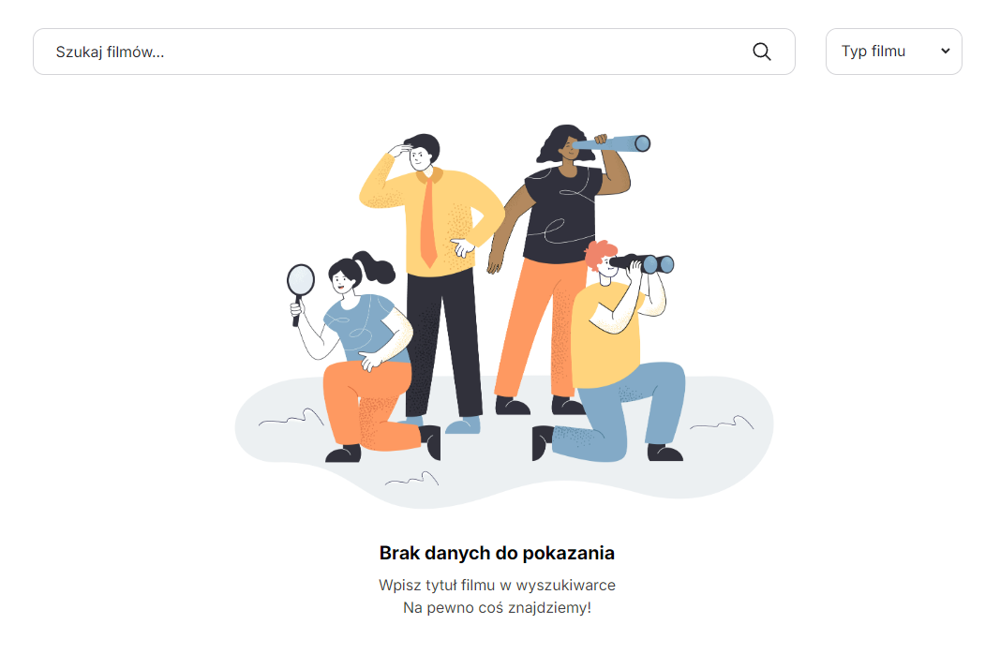

# Zadanie rekrutacyjne Admad



---
## 🚀 Setup

1. Copy .env.example to .env

2. Install dependencies:
``` npm install ```

3. Run the development server:
``` npm run dev```

4. Open [http://localhost:5173](http://localhost:5173/) with your browser to see the result.